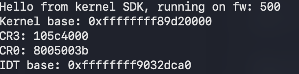

# PS5 kldload

This is a kernel module loader for the PlayStation 5 that aims to provide a deeper understanding of the system's internals and assist in my research into its internals.

The hypervisor remains active and untouched, but the kernel modules run normally and in harmony with it.

## How It Works

This tool is the result of deep research into the system, assisted by [kstuff](https://github.com/buzzer-re/playstation_research_utils/tree/dc5a29fa289321cc983e8560a054f6e5207ec1af/ps5_kernel_research/kstuff-no-fpkg). It is made possible by the creation of two new [kekcalls](src/kekcall.asm) (a communication interface between userland and kstuff) to create executable memory in the kernel and launch kthreads (kernel threads).

On PlayStation 4 systems, developers were able to patch the running kernel to force it to always allocate read-write-executable memory areas in the kmem_alloc function. On the PlayStation 5, things are a bit different, with a few caveats, such as the Hypervisor, that prevent .text read/write access due to the XOM.

However, kstuff doesn’t patch the kernel. Instead, it uses kernel read/write (RW) primitives to register itself in the Interrupt Descriptor Table (IDT) to capture general protection faults (int13) and debug traps (int1). With the necessary gadgets, it can also read and write to the debug registers. To modify the kernel code, it sets specific breakpoints in the kernel and then modifies the register state to achieve the desired behavior. This is how important patches, such as the mprotect patch (which enables PROT_EXEC protection in userland), have been applied.

To make the kernel memory allocation work, one must first replicate the same fix in the kmem_alloc function.

## Calling Kernel Functions

Kstuff introduces a concept called kekcalls, which are encoded function calls inside the RAX register when userland performs a syscall. When hooking all system calls in the #GP handler, it will verify if the getppid syscall is being called (or any other syscall with no arguments and which isn’t called frequently). It will then extract the kekcall number from the upper bits of the RAX register, since the syscall number is stored in EAX.

This makes it easy to extend kstuff with more kekcalls. For example, I created the kmalloc and kproc_create kekcalls, which internally adjust the arguments and change the RIP to point to these functions.


## Memory Allocation and Kernel Patches

`kmalloc` is not the initial target. It will eventually call kmem_alloc if the current malloc [arena](https://www.rfleury.com/p/untangling-lifetimes-the-arena-allocator) is smaller than the requested size. This is a difficult situation to achieve, so the first "patch" is used to force kmalloc to request more memory by setting a breakpoint into the arena size check. This triggers the second patch, kmem_alloc_rw_fix, which replaces the default permissions of PROT_READ|PROT_WRITE with [PROT_READ|PROT_WRITE|PROT_EXEC](https://github.com/buzzer-re/playstation_research_utils/blob/dc5a29fa289321cc983e8560a054f6e5207ec1af/ps5_kernel_research/kstuff-no-fpkg/ps5-kstuff/uelf/kekcall.c#L37).

Once that is done, it’s simply a matter of creating another kekcall to invoke `kproc_create`, which will create a new kthread.

## Supported Firmware

Currently supported firmware:

- 4.03

For more supported firwmares, use the the [dev](https://github.com/buzzer-re/PS5_kldload/tree/dev) branch.

# Building and Using

Make sure to have the latest version of the [SDK](https://github.com/ps5-payload-dev/sdk) installed.

Clone the repository recursively:

> git clone --recursive https://github.com/buzzer-re/PS5_kldload.git

Then, you can build and run the tool with:

> make clean && make && make test

It will listen on port 9022 and launch any kernel payloads in kernel mode.
## Example

Kernel payloads can be written similarly to how they were written for the PlayStation 4. In the future, an SDK might be developed to assist with this. Below is a simple [hello_world](https://github.com/buzzer-re/PS5_kldload/tree/main/examples/hello_world) example that reads the `MSR_LSTAR` value. Full source code can be found here.

```c
#include "../include/firmware/offsets.h"

#define MSR_LSTAR 0xC0000082
typedef unsigned long uint64_t;
typedef unsigned int uint32_t;

inline uint64_t __readmsr(uint32_t msr) // wrapper for the rdmsr instruction
{
    uint32_t low, high;
    __asm__("rdmsr" : "=a"(low), "=d"(high) : "c"(msr));
    return (low | ((uint64_t) high << 32));
}

typedef struct __kproc_args
{
    uint64_t kdata_base;
} kproc_args;

void (*kprintf)(char* fmt, ...);
uint64_t kdata_address;

void init_kernel()
{
    kprintf = (void (*)(char*, ...)) (kdata_address + kprintf_offset);
}

int module_start(kproc_args* args)
{
    kdata_address = args->kdata_base;
    init_kernel();

    kprintf("Hello from kernel land! Let's check the MSR_LSTAR value!\n");
    kprintf("MSR_LSTAR => %#02lx\n", __readmsr(MSR_LSTAR));

    return 1;
}
```

Send it with `socat -t 99999999 - TCP:PS5_IP:9022 < hello_world.bin` then you can check the `klogs`:




## Future work

Here's a few things that I'm currently working and need assistance for anyone willing to help with:


- SDK and ELF loader for KLD
    - Similar on how FreeBSD already does, it's good to have a well defined format and loader similar to the current ones
- Offsets acquiring and function definitions
    - There is a lot of offsets already defined on the [offsets.c](https://github.com/buzzer-re/playstation_research_utils/blob/dc5a29fa289321cc983e8560a054f6e5207ec1af/ps5_kernel_research/kstuff-no-fpkg/prosper0gdb/offsets.c), some of them need a function definition to be used 

- Firmware support
    - Expand to other firmware is a major achievement, can be done just by acquiring the necessary offsets, acquiring that ones are beyond the scope of that project (pure debugging/reversing)

- Crashes mapping
    - There are a few operations that can crash the system, such as read the `CR0` register, they are mostly caused by the Hypervisor


