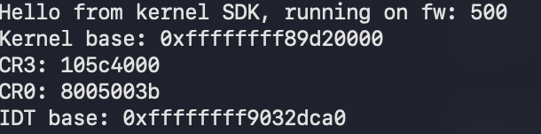

# PS5 kldload

This is a kernel module loader for the PlayStation 5 that aims to provide a deeper understanding of the system's internals and assist in my research into its internals.

The hypervisor remains active and untouched, but the kernel modules run normally and in harmony with it.

## How It Works

On PlayStation 4 systems, developers were able to patch the running kernel to force it to always allocate read-write-executable memory areas in the kmem_alloc function. On the PlayStation 5, things are a bit different, with a few caveats, such as the Hypervisor, that prevent .text read/write access due to `XOM` and the assumption that `GMET` is enabled.

GMET (Guest Mode Execute) is an AMD technology used by its hypervisor to specifically control which pages can execute at the guest level. When it is enabled and properly configured, the guest cannot request executable pages or execute code outside the allowed area. 

The PlayStation 5 lacks this configuration until firmware `6.50`. kldload works by requesting such pages, writing code into them using the kernel read/write primitives, and executing it as a real kthread, thus allowing real kernel-level code execution on the device.

## Supported Firmware

Currently supported firmware:

- 3.0
- 3.10
- 3.20
- 3.21
- 4.03
- 4.51
- 5.0
- 5.02
- 5.10
- 5.50
- 6.0 (Unstable) 
- 6.02 (Unstable)
- 6.50 (Unstable)


# Building and Using

Make sure to have the latest version of the [SDK](https://github.com/ps5-payload-dev/sdk) installed.

Clone the repository recursively:

> git clone https://github.com/buzzer-re/PS5_kldload.git

Configure the Makefile to your IP address, then you can build and run the tool with:

> make clean && make && make test

It will listen on port 9022 and launch any kernel payloads in kernel mode.


## Example

Kernel payloads can be written similarly to how they were written for the PlayStation 4. You can use the [ps5-kld-sdk](https://github.com/buzzer-re/ps5-kld-sdk) to assist development. 

Below is a simple [hello_world](https://github.com/buzzer-re/ps5-kld-sdk/blob/master/sample/hello_world/src/main.c) example:

```c
#include <ps5kld/kernel.h>
#include <ps5kld/intrin.h>
#include <ps5kld/dmap.h>
#include <ps5kld/machine/idt.h>

int module_start(kproc_args* args)
{
    kprintf("Hello from kernel SDK, running on fw: %x\n", args->fwver);
    kprintf("Kernel base: %#02lx\n", args->kdata_base);

    uint8_t idt[10];
    __sidt((uint64_t*)idt);

    IDTR* idtr = (IDTR*) idt;

    kprintf("CR3: %x\nCR0: %x\nIDT base: %#02lx\n",
        __readcr3(),
        __readcr0(),
        idtr->base
    );


    return 0;
}

```

Send it with `socat -t 99999999 - TCP:PS5_IP:9022 < hello_world.bin` then you can check the `klogs`:


